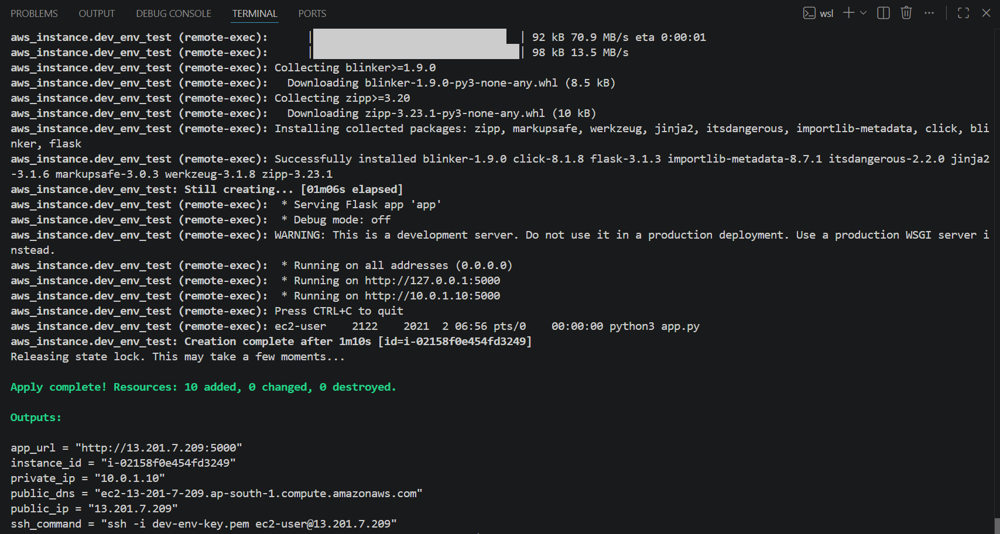
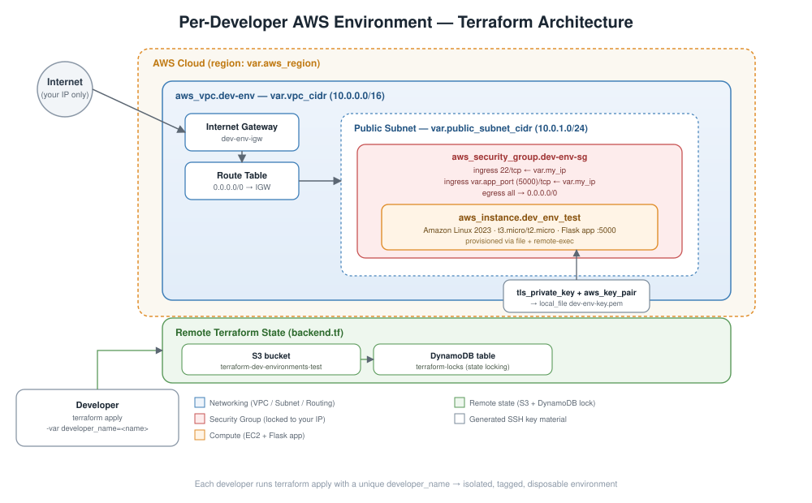
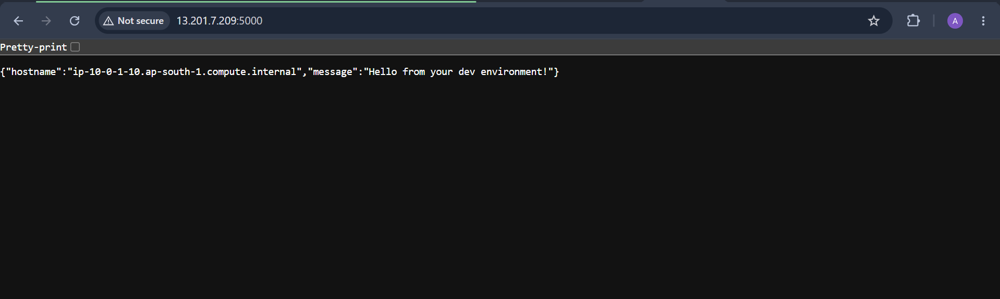

# terraform-dev-environments

**On-demand, isolated AWS development environments — provisioned in minutes, torn down in seconds.**

This Terraform project spins up a self-contained sandbox on AWS for each developer: its own VPC, subnet, security group, SSH key pair, and an EC2 instance that automatically installs and runs a Flask application. Environments are tagged and named per developer, so any number of people can run this project in parallel without colliding, and remote state (S3 + DynamoDB) keeps everyone's `terraform apply` safe to run concurrently.



---

## Table of Contents

- [Why this exists](#why-this-exists)
- [Architecture](#architecture)
- [Repository structure](#repository-structure)
- [Prerequisites](#prerequisites)
- [Quick start](#quick-start)
- [Configuration reference](#configuration-reference)
  - [Input variables](#input-variables)
  - [Outputs](#outputs)
- [Verifying the deployment](#verifying-the-deployment)
- [Cleaning up](#cleaning-up)
- [Security notes](#security-notes)
- [Cost](#cost)
- [Troubleshooting](#troubleshooting)
- [Roadmap ideas](#roadmap-ideas)
- [License](#license)

---

## Why this exists

Shared dev/staging environments get noisy fast — one developer's changes step on another's, and nobody wants to wait for a ticket to get a box to test on. This project gives each developer their own throwaway AWS environment:

- **Isolated** — every resource is namespaced with `developer_name`, so two people can deploy at the same time without name or state collisions.
- **Locked down** — SSH and application ports are only open to the IP address you supply; nothing is exposed to the wider internet.
- **Reproducible** — the entire stack (network, security, compute, app bootstrap) is defined as code and created with a single `terraform apply`.
- **Disposable** — `terraform destroy` removes everything cleanly, so environments don't linger and accrue cost.
- **Free-tier friendly** — defaults to `t2.micro`/`t3.micro` and an 8 GB gp3 root volume.

## Architecture



**Flow:**

1. A developer runs `terraform apply -var="developer_name=<name>" -var="my_ip=<ip>/32"`.
2. Terraform provisions a dedicated **VPC** (`10.0.0.0/16` by default) with a **public subnet** (`10.0.1.0/24`), an **Internet Gateway**, and a **route table** sending `0.0.0.0/0` traffic out through the gateway.
3. A **security group** is created that only allows inbound SSH (22) and the Flask app port (5000 by default) from the developer's own IP — everything else inbound is denied, and all outbound traffic is allowed.
4. Terraform generates a fresh **RSA key pair** with the `tls` provider, registers the public half as an `aws_key_pair`, and writes the private half locally to `dev-env-key.pem` (permissions `0600`, git-ignored).
5. An **EC2 instance** (Amazon Linux 2023, resolved dynamically via an AMI data source) is launched into the public subnet using that key pair and security group.
6. Terraform's `file` and `remote-exec` provisioners copy `app.py` onto the instance, install Python/Flask, and start the app in the background — no manual SSH step required.
7. Terraform outputs the instance's public IP/DNS, a ready-to-use app URL, and the exact SSH command to connect.
8. State is stored remotely in an **S3 bucket** with a **DynamoDB** table for locking, so concurrent runs by different developers don't corrupt shared state.

## Repository structure

```
terraform-dev-environments/
├── provider.tf              # Terraform & provider configuration (aws, tls, local)
├── backend.tf                # Remote state: S3 backend + DynamoDB locking
├── variables.tf               # Input variable declarations
├── main.tf                    # VPC, subnet, routing, security group, key pair, EC2 instance
├── output.tf                  # Instance IP/DNS, app URL, SSH command outputs
├── app.py                     # Minimal Flask app deployed to the instance
├── .terraform.lock.hcl        # Provider version lock file
├── .gitignore                 # Excludes state, tfvars, and generated key material
└── Images/
    ├── architecture-diagram.svg
    ├── terraform_apply_output.png
    └── web_output.png
```

## Prerequisites

| Requirement | Notes |
|---|---|
| [Terraform](https://developer.hashicorp.com/terraform/install) ≥ 1.x | Tested against provider versions pinned in `.terraform.lock.hcl`: `hashicorp/aws` 6.56.0, `hashicorp/tls` 4.3.0, `hashicorp/local` 2.9.0 |
| AWS account + credentials | Configured via the standard AWS credential chain (`aws configure`, environment variables, or an SSO profile) with permissions to manage VPC, EC2, IAM key pairs, S3, and DynamoDB |
| An existing S3 bucket and DynamoDB table for remote state | Referenced in `backend.tf` — create these once, up front (see below) |
| Your public IP address | Used to lock down SSH/app access; find it at [checkip.amazonaws.com](https://checkip.amazonaws.com) |

**One-time backend setup.** `backend.tf` expects an S3 bucket named `terraform-dev-environments-test` and a DynamoDB table named `terraform-locks` (partition key `LockID`, type String) in `us-east-1`. Create these once before the first `terraform init`, or update `backend.tf` to point at your own bucket/table/region.

## Quick start

```bash
# 1. Clone the repo
git clone <this-repo-url>
cd terraform-dev-environments

# 2. Initialize Terraform (downloads providers, configures the S3 backend)
terraform init

# 3. Look up your public IP
curl -s https://checkip.amazonaws.com

# 4. Preview the plan
terraform plan \
  -var="developer_name=<your-name>" \
  -var="my_ip=<your-ip>/32"

# 5. Apply
terraform apply \
  -var="developer_name=<your-name>" \
  -var="my_ip=<your-ip>/32"
```

Or, to avoid retyping flags, create a git-ignored `terraform.tfvars`:

```hcl
developer_name = "alice"
my_ip          = "203.0.113.5/32"
```

then simply run `terraform apply`.

Once applied, Terraform prints the app URL and SSH command as outputs — no manual lookup needed.

## Configuration reference

### Input variables

| Name | Description | Type | Default | Required |
|---|---|---|---|---|
| `aws_region` | AWS region to deploy into | `string` | `us-east-1` | no |
| `developer_name` | Name/handle used to name, tag, and isolate your environment | `string` | — | **yes** |
| `instance_type` | EC2 instance type (Free Tier eligible: `t2.micro`/`t3.micro`) | `string` | `t2.micro` | no |
| `app_port` | Port the Flask app listens on | `number` | `5000` | no |
| `my_ip` | Your public IP in CIDR form, e.g. `203.0.113.5/32` — restricts SSH and app access to just you | `string` | — | **yes** |
| `vpc_cidr` | CIDR block for the VPC | `string` | `10.0.0.0/16` | no |
| `public_subnet_cidr` | CIDR block for the public subnet | `string` | `10.0.1.0/24` | no |

### Outputs

| Name | Description |
|---|---|
| `instance_id` | EC2 instance ID |
| `public_ip` | Public IP address of the instance |
| `public_dns` | Public DNS name of the instance |
| `private_ip` | Private IP address of the instance |
| `app_url` | Ready-to-use URL for the Flask app (`http://<public_ip>:<app_port>`) |
| `ssh_command` | Exact `ssh -i dev-env-key.pem ec2-user@<public_ip>` command to connect |

## Verifying the deployment

After `terraform apply` completes, hit the printed `app_url` in your browser or with `curl`:

```bash
curl $(terraform output -raw app_url)
```

You should see a JSON response confirming the app is live on your instance:



A `/health` endpoint is also available for basic liveness checks (`GET /health` → `{"status": "ok"}`).

To SSH in directly, use the printed output:

```bash
$(terraform output -raw ssh_command)
```

## Cleaning up

Environments are meant to be disposable. When you're done:

```bash
terraform destroy \
  -var="developer_name=<your-name>" \
  -var="my_ip=<your-ip>/32"
```

This tears down the instance, security group, networking, and generated key pair. Remember to delete the local `dev-env-key.pem` file yourself if you no longer need it (it isn't managed by Terraform's destroy of AWS resources).

## Security notes

- **No open ports.** SSH (22) and the app port are restricted to the CIDR you pass in via `my_ip` — never `0.0.0.0/0`. Double-check this value before applying, especially if your IP changes.
- **Generated keys are git-ignored.** `dev-env-key.pem` is created fresh per apply and excluded via `.gitignore`. Never commit it, and rotate/destroy it if it's ever exposed.
- **State contains sensitive data.** The private key material passes through Terraform state. State is stored remotely in S3 with encryption enabled (`encrypt = true` in `backend.tf`); ensure the bucket has versioning, encryption-at-rest, and restricted IAM access enabled.
- **Per-developer isolation** relies on unique `developer_name` values — pick something that won't collide with a teammate's.

## Cost

Default sizing (`t2.micro`/`t3.micro`, 8 GB gp3 volume) fits within the AWS Free Tier for eligible accounts. Outside the Free Tier, expect roughly the on-demand hourly rate for the instance type plus negligible EBS/network costs for typical dev usage. Run `terraform destroy` when you're done to avoid ongoing charges — nothing here is designed to run 24/7.

## Troubleshooting

| Symptom | Likely cause / fix |
|---|---|
| `terraform init` fails to configure the backend | The S3 bucket or DynamoDB table in `backend.tf` doesn't exist yet, or your credentials lack access — create them first (see [Prerequisites](#prerequisites)) |
| Connection to the app or SSH times out | `my_ip` is stale or wrong — re-check `https://checkip.amazonaws.com` and re-apply |
| `remote-exec` provisioner hangs or fails | The instance may still be initializing, or outbound internet access is blocked — check the security group's egress rule and the instance's system log |
| App isn't reachable right after apply | Give it a few seconds — the provisioner installs Python/Flask and starts the app as part of `terraform apply`; check `app.log` on the instance via SSH if it doesn't come up |

## Roadmap ideas

- Parameterize the backend bucket/table/region instead of hardcoding them in `backend.tf`
- Add an Elastic IP option so the address survives instance replacement
- Support HTTPS via an Application Load Balancer + ACM certificate
- Add a `Makefile` or `justfile` to wrap common `plan`/`apply`/`destroy` invocations

## License

No license file is currently included in this repository. Add one (e.g. MIT, Apache-2.0) if you intend for others to reuse this code.
